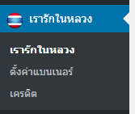
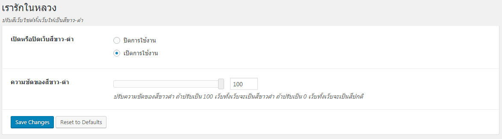
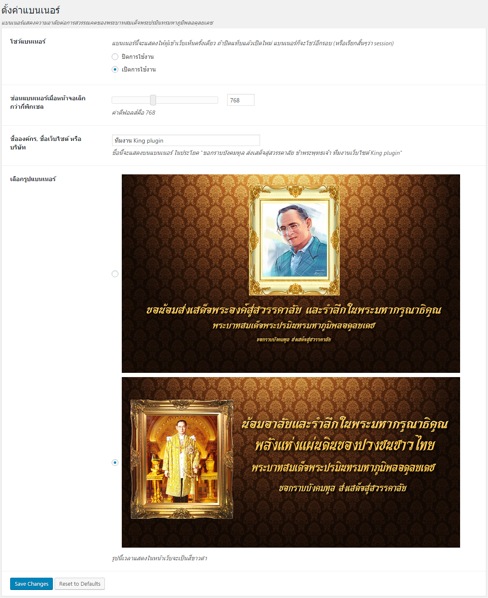
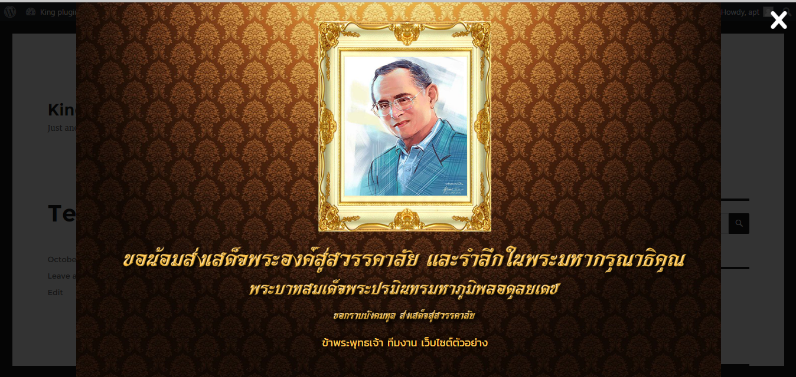
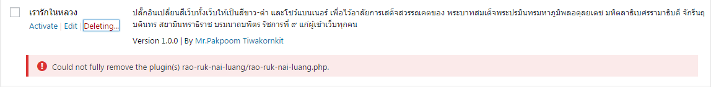
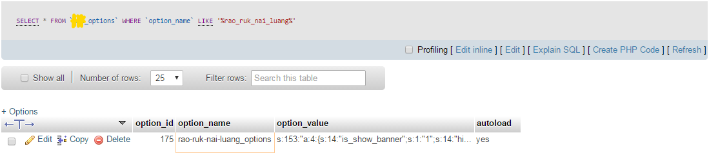
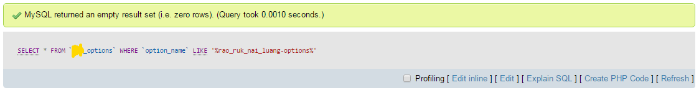

ปลั๊กอิน WordPress ฟรี โดยคนไทย สำหรับเปลี่ยนสีเว็บทั้งเว็บให้เป็นสีขาว-ดำ และโชว์แบนเนอร์เพื่อไว้อาลัยการเสด็จสวรรณคตของ ในหลวงรัชการที่ ๙
ผมทำปลั๊กอินนี้มาด้วยใจครับ ไม่ต้องการเงิน ผมแค่อยากให้เจ้าของเว็บไซต์ทุกคนมีโอกาสไว้อาลัยให้กับพระองค์ท่าน จึงทำปลั๊กอินนี้ขึ้นมาครับ
หากใช้งานแล้วเจอปัญหา หรือมีไอเดียให้ผมพัฒนาเพิ่มติดต่อมาได้ที่ [Githup Issues](https://github.com/aptarmy/rao-ruk-nai-luang/issues)

วิธีใช้งาน
===========
หลังจากติดตั้งแล้ว จะมีเมนูให้เลือกตามภาพครับ

## ตั้งค่าเปลี่ยนเว็บเป็นสีขาวดำ
ให้คลิ๊กเลือกเมนู `เรารักในหลวง` จะเป็นตัวตั้งค่าให้เว็บเป็นสีขาวดำ ว่าจะเปิดการใช้งาน
หรือปรับความชัดของสีขาวดำ ถ้าปรับเป็น 100 เว็บทั้งเว็บจะเป็นสีขาวดำ ถ้าปรับเป็น 0 เว็บทั้งเว็บจะเป็นสีปกติครับ

## ตั้งค่าแบนเนอร์ไว้อาลัย
ให้คลิ๊กเลือกเมนู `ตั้งค่าแบนเนอร์` จะเจอหน้าตาแบบนี้ครับ

ซึ่งเราสามารถตั้งค่าได้หลายตัวครับ

- โชว์หรือไม่โชว์แบนเนอร์
- ซ่อนแบนเนอร์เมื่อหน้าจอเล็กกว่ากี่พิกเซลแบบ Responsive
- `ชื่อองค์กร, ชื่อเว็บไซต์ หรือบริษัท` - ชื่อนี้จะแสดงบนแบนเนอร์ ในประโยค "ด้วยเกล้าด้วยกระหม่อมขอเดชะ ข้าพระพุทธเจ้า ทีมงานเว็บไซต์ ABCD"
- เลือกว่าจะเอาแบนเนอร์แบบใหน **ซึ่งผมเป็นคนออกแบบแบนเนอร์นี้ขึ้นมาเอง ถ้าเพื่อนๆต้องการแบนเนอร์แบบใหนเพิ่มเติมเสนอไอเดียมาได้เลยครับพ้ม**

เสร็จแล้วก็จะได้แบนเนอร์แบบนี้ครับ

## ถ้ากด uninstall ปลั๊กอินแล้ว WordPress ขึ้น แบบนี้ ไม่ต้องตกใจครับ
เพราะว่าในโฟลเดอร์ปลั๊กอินมีโฟลเดอร์ `.git` อยู่ แค่ลบโฟลเดอร์ปลั๊กอินทิ้ง ก็เรียบร้อยครับ

## ข้อมูลเพิ่มเติมสำหรับผู้ใช้งานที่พอมีความรู้เรื่อง database
ปลั๊กอินตัวนี้จะเก็บข้อมูลการตั้งค่าในเทเบิ้ล `wp_options` แค่เรคคอร์ดเดียวครับ ขณะใช้งาน เทเบิ้ล `wp_options` จะเป็นแบบนี้ครับ

เวลา uninstall ปลั๊กอิน ระบบจะเคลียร์ข้อมูลเรคคอร์ดนี้ให้อัตโนมัติครับ ไม่ต้องห่วงเรื่องข้อมูลขยะใน database ครับ
ใน database จะสะอาดเหมือนเดิมแบบนี้ครับ

## ให้เครดิตเจ้าของรูปภาพ นักพัฒนาฟอนต์ และนักพัฒนาเฟรมเวิร์ค
ปลั๊กอินนี้จะเกิดขึ้นไม่ได้ หากไม่มีวัตถุดิบเหล่านี้ ผมจึงขอให้เครดิตเครื่องมือ(framework) รูปภาพ กับฟอนต์ที่เอามาทำแบนเนอร์ และปลั๊กอินครับ
ผมขอขอบคุณเจ้าของผลงานทุกๆท่านไว้ ณ ที่นี้ด้วยครับ

### ขอบคุณ framework จาก

- http://www.titanframework.net/

### ขอบคุณรูปภาพจาก

- http://www.sangkhacrst.org/?attachment_id=21
- http://www.bkk1.in.th/Topic.aspx?TopicID=204872
- http://www.overstockart.com/frame/victorian-gold-frame-20x24

### ขอบคุณฟอนต์จาก

- http://www.f0nt.com/release/saruns-manorah/